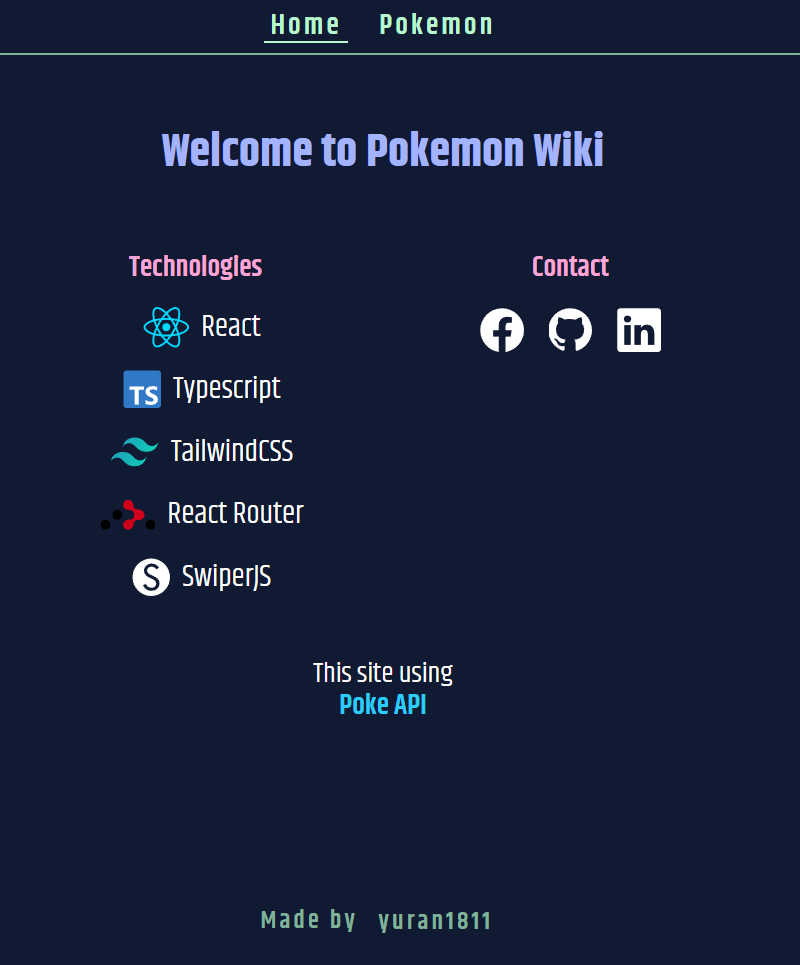
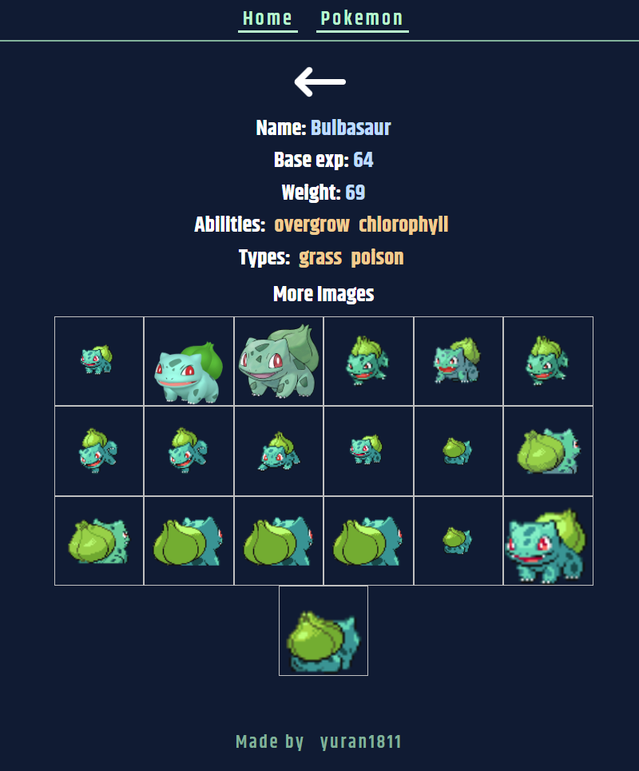
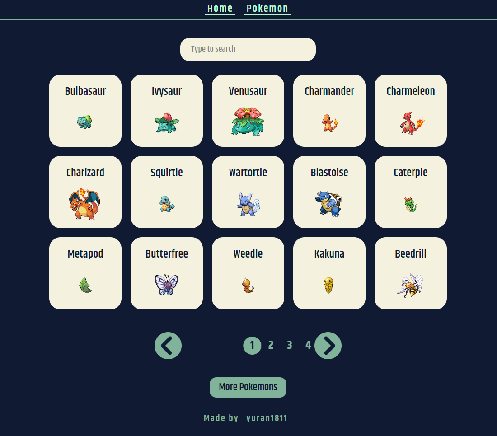
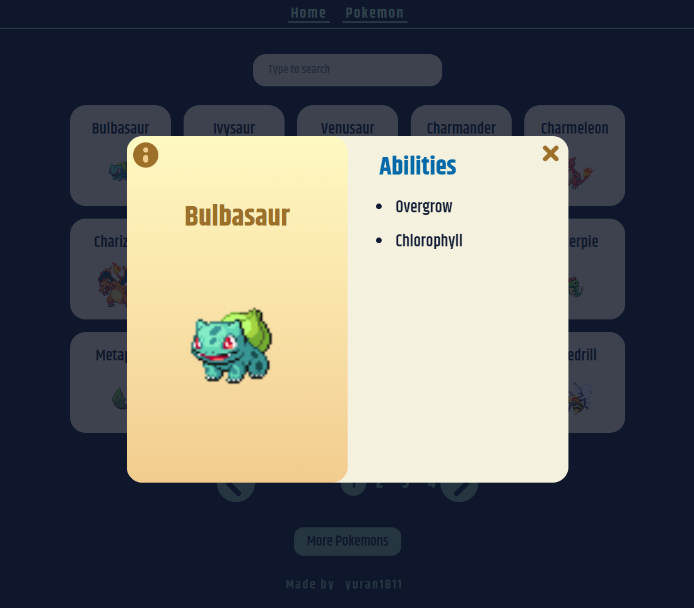

<h1 align="center">pokemon</h1>
<p align="center" style="font-size:16px"><strong>Showcase of pokemons.</strong></p>
<p align="center">  
  
</p>

<p align="center">
  
  
  
  
  
</p>

<div align="center"><a href="https://yuran1811.github.io/pokemon" target="_blank">Live Demo</a></div>

## Features

- [x] Show pokemons page-by-page
- [x] Search pokemons by name
- [x] Detail pokemon's info
- [ ] Filter pokemons by following options

## Tech Stack


- Other libs:
  - React Router v7
  - SwiperJS v11

## Screenshots

<div style="display:flex;gap:12px;justify-content:center">
	
	
</div>

<div style="display:flex;gap:12px;justify-content:center">
	
	
</div>

## Quick Start

Follow these steps to set up the project locally on your machine.

**Prerequisites**

Make sure you have the following installed or downloaded on your machine:

- [Git](https://git-scm.com/)
- [Node.js](https://nodejs.org/en)

**Cloning the Repository**

```bash
git clone https://github.com/yuran1811/pokemon.git
cd pokemon
```

**Installation**

- Enable `pnpm` to build and run the project

```bash
corepack enable pnpm
```

Install the project dependencies:

```bash
pnpm install
```

**Running the Project**

```bash
pnpm dev
```

Open [http://localhost:5173](http://localhost:5173) in your browser to view the project.

## References

- [**Poke API**](https://pokeapi.co/)
